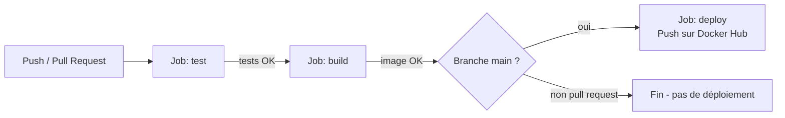

# Pipeline CI/CD

Remplacez `REMPLACER_PAR_VOTRE_USER` par votre nom d'utilisateur GitHub une fois le dépôt créé, pour que le badge ci-dessus s'affiche correctement dans votre README.

## Vue d'ensemble

Le pipeline est défini dans [`.github/workflows/ci-cd.yml`](../.github/workflows/ci-cd.yml) et s'exécute automatiquement sur GitHub Actions.

## Déclencheurs (triggers)

| Événement | Effet |
|---|---|
| `push` sur `main` | Exécute test → build → deploy |
| `pull_request` vers `main` | Exécute test → build (pas de déploiement, pour valider une contribution avant fusion) |
| `workflow_dispatch` | Permet de relancer le pipeline manuellement depuis l'onglet Actions de GitHub |

## Les 3 jobs

### 1. `test` — Tests unitaires
- Installe les dépendances de l'API (`api/requirements.txt`) + `pytest`/`httpx`.
- Exécute `pytest tests/` : 14 tests couvrant les endpoints `/health`, `/metadata`, `/predict` et `/recommend` (cas valides, cas invalides — culture/région/sol inconnus, champ manquant — et couverture des 6 cultures).
- Publie les résultats (`test-results.xml`) comme artefact du run, consultable dans l'onglet Actions.
- **Le pipeline s'arrête ici si un test échoue** : les jobs suivants ne se lancent pas (`needs: test`).

### 2. `build` — Construction de l'image Docker
- Construit l'image Docker de l'API à partir de `api/Dockerfile`, sans la publier.
- Objectif : garantir que le `Dockerfile` reste valide à chaque modification du code, même sur une pull request qui ne sera pas déployée.

### 3. `deploy` — Publication (uniquement sur `main`)
- Se déclenche seulement si le push a lieu sur `main` (pas sur une pull request).
- Se connecte à Docker Hub avec les secrets du dépôt et publie l'image taguée `latest` et avec le hash du commit.
- **Secrets GitHub requis** (à configurer dans *Settings → Secrets and variables → Actions* du dépôt) :
  - `DOCKERHUB_USERNAME` : votre nom d'utilisateur Docker Hub.
  - `DOCKERHUB_TOKEN` : un [Access Token Docker Hub](https://hub.docker.com/settings/security) (ne jamais utiliser votre mot de passe).
- **Streamlit Community Cloud** : une fois l'application connectée depuis [share.streamlit.io](https://share.streamlit.io) (en pointant vers `app/app.py` de ce dépôt), elle se redéploie automatiquement à chaque push sur `main`. Aucune étape supplémentaire n'est nécessaire dans le workflow.

## Bonnes pratiques appliquées

- **Aucun secret en clair** : les identifiants Docker Hub sont lus depuis les secrets GitHub, jamais écrits dans le code.
- **Échec explicite** : chaque étape critique (tests, build) fait échouer le job entier si elle échoue, empêchant un déploiement basé sur du code cassé.
- **Cache des layers Docker** (`cache-from`/`cache-to: type=gha`) pour accélérer les builds successifs.
- **Reproductibilité** : versions de Python et des dépendances figées (`requirements.txt`).

## Notifications d'échec

GitHub envoie par défaut un e-mail à l'auteur du commit/de la pull request en cas d'échec du pipeline. Pour des notifications plus visibles (Slack, Teams...), une action comme `slackapi/slack-github-action` peut être ajoutée au job `test` avec `if: failure()`.
