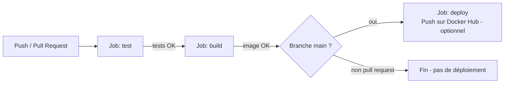

# Pipeline CI/CD

## Vue d'ensemble

Le pipeline est défini dans [`.github/workflows/ci-cd.yml`](../.github/workflows/ci-cd.yml) et s'exécute automatiquement sur GitHub Actions.

Le déploiement réel de l'application (API + interface) ne passe pas par ce
job Docker Hub : il est géré directement par Render et Streamlit Community
Cloud, tous deux connectés à ce dépôt GitHub (voir "Déploiement en ligne"
plus bas). Le job `deploy` ci-dessous n'est qu'une démonstration optionnelle
de publication d'image Docker. Les liens entre les tests GitHub et ces
déploiements, et leurs limites, sont détaillés dans la section
"Limites du pipeline".

## Déclencheurs (triggers)

| Événement | Effet |
|---|---|
| `push` sur `main` | Exécute test → build → deploy |
| `pull_request` vers `main` | Exécute test → build (pas de déploiement, pour valider une contribution avant fusion) |
| `workflow_dispatch` | Permet de relancer le pipeline manuellement depuis l'onglet Actions de GitHub |

## Les 3 jobs

### 1. `test` — Tests unitaires
- Installe les dépendances de l'API (`api/requirements.txt`) + `pytest`/`httpx`.
- Exécute `pytest tests/` : 14 tests couvrant les endpoints `/health`, `/metadata`, `/predict` et `/recommend` (cas valides, cas invalides — culture/région/sol inconnus, champ manquant — et couverture des 6 cultures).
- Publie les résultats (`test-results.xml`) comme artefact du run, consultable dans l'onglet Actions.
- **Le pipeline s'arrête ici si un test échoue** : les jobs suivants ne se lancent pas (`needs: test`).

### 2. `build` — Construction de l'image Docker
- Construit l'image Docker de l'API à partir de `api/Dockerfile`, sans la publier.
- Objectif : garantir que le `Dockerfile` reste valide à chaque modification du code, même sur une pull request qui ne sera pas déployée.

### 3. `deploy` — Publication Docker Hub (optionnelle, désactivée par défaut)
- Se déclenche seulement si le push a lieu sur `main` **et** si la variable de
  dépôt `ENABLE_DOCKERHUB_DEPLOY` vaut `true`. Par défaut cette variable
  n'existe pas : le job apparaît donc en gris ("skipped"), jamais en échec.
- Si activé, se connecte à Docker Hub avec les secrets du dépôt et publie
  l'image taguée `latest` et avec le hash du commit.
- **Pour l'activer** (facultatif, non nécessaire pour la mission) :
  1. *Settings → Secrets and variables → Actions → Variables* : créer une
     variable `ENABLE_DOCKERHUB_DEPLOY` = `true`.
  2. *Settings → Secrets and variables → Actions → Secrets* : créer
     `DOCKERHUB_USERNAME` (votre pseudo Docker Hub) et `DOCKERHUB_TOKEN` (un
     [Access Token Docker Hub](https://hub.docker.com/settings/security),
     jamais votre mot de passe).

## Déploiement en ligne

Docker Hub n'est qu'un **entrepôt d'images** : y publier une image ne rend
pas l'application accessible en ligne. Le projet est donc déployé sur deux
plateformes gratuites, connectées directement à ce dépôt GitHub :

- **API (FastAPI)** sur [Render](https://render.com) : Render lit
  `api/Dockerfile`, construit l'image et l'exécute. Le service est réglé en
  *Auto-Deploy : After CI Checks Pass* : un push sur `main` n'est déployé que
  si les jobs GitHub Actions (tests et build) ont réussi. Offre gratuite : le
  service se met en veille après 15 minutes sans requête et se réveille en
  environ 1 minute au premier appel suivant.
- **Interface (Streamlit)** sur
  [Streamlit Community Cloud](https://share.streamlit.io) : connectée à
  `app/app.py`, elle se redéploie à chaque push sur `main`. Le secret
  `API_URL` pointe vers l'URL Render de l'API. Application en ligne :
  [https://agritech-crop-recommender-api.streamlit.app/](https://agritech-crop-recommender-api.streamlit.app/).

Voir le README, section "Déploiement en ligne", pour la procédure pas à pas.

## Limites du pipeline

Le pipeline automatise les tests et la construction de l'image, mais il ne
couvre pas toute la chaîne, de l'entraînement jusqu'à la mise en ligne :

1. **Le modèle n'est pas réentraîné par le pipeline.** L'entraînement
   (`python src/train.py`) se lance à la main, en local : les données brutes
   (environ 100 Mo) ne sont pas versionnées dans Git et l'entraînement complet
   prend plusieurs minutes. À la fin, `train.py` copie automatiquement le
   modèle, ses métadonnées et les benchmarks dans `api/models/`. Ce dossier,
   versionné dans Git, est ce que l'API sert. Un nouveau modèle n'est donc mis
   en production que lorsque ces fichiers sont commités puis poussés. Les
   tests vérifient alors que l'API fonctionne avec ce modèle, mais aucune
   vérification automatique ne contrôle que ses performances ne se sont pas
   dégradées.
2. **Les déploiements sont déclenchés par les plateformes, pas par le
   pipeline.** Render et Streamlit Community Cloud surveillent eux-mêmes la
   branche `main` :
   - **Render (API)** attend la réussite des jobs GitHub Actions grâce au
     réglage *After CI Checks Pass* (*Settings → Build & Deploy →
     Auto-Deploy*). Sans ce réglage (mode par défaut *On Commit*), l'API
     serait redéployée à chaque push, même si les tests échouent.
   - **Streamlit Community Cloud (interface)** ne propose pas cette option :
     l'interface est redéployée à chaque push sur `main`, que les tests
     passent ou non. Le risque reste limité, car l'interface ne contient
     aucune logique de Machine Learning et ne fait qu'appeler l'API.

**Pistes d'amélioration :**
- déclencher le déploiement Render depuis le pipeline, après les tests, via
  son *Deploy Hook* (une URL propre au service, à stocker dans un secret
  GitHub) ;
- ajouter au pipeline un job qui vérifie les performances du modèle commité
  (par exemple un RMSE maximal sur un petit jeu de validation versionné),
  pour bloquer un modèle dégradé ;
- à plus long terme, stocker les données et les modèles hors de Git (DVC,
  registre de modèles MLflow) pour pouvoir réentraîner automatiquement.

## Bonnes pratiques appliquées

- **Aucun secret en clair** : les identifiants Docker Hub sont lus depuis les secrets GitHub, jamais écrits dans le code.
- **Échec explicite** : chaque étape critique (tests, build) fait échouer le job entier si elle échoue. Côté API, Render ne déploie qu'après la réussite de ces jobs (voir "Limites du pipeline" pour l'interface).
- **Cache des layers Docker** (`cache-from`/`cache-to: type=gha`) pour accélérer les builds successifs.
- **Reproductibilité** : versions de Python et des dépendances figées (`requirements.txt`).

## Notifications d'échec

GitHub envoie par défaut un e-mail à l'auteur du commit/de la pull request en cas d'échec du pipeline. Pour des notifications plus visibles (Slack, Teams...), une action comme `slackapi/slack-github-action` peut être ajoutée au job `test` avec `if: failure()`.
